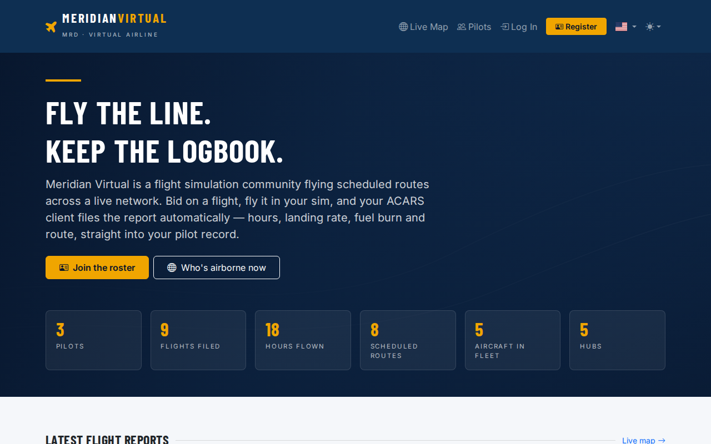
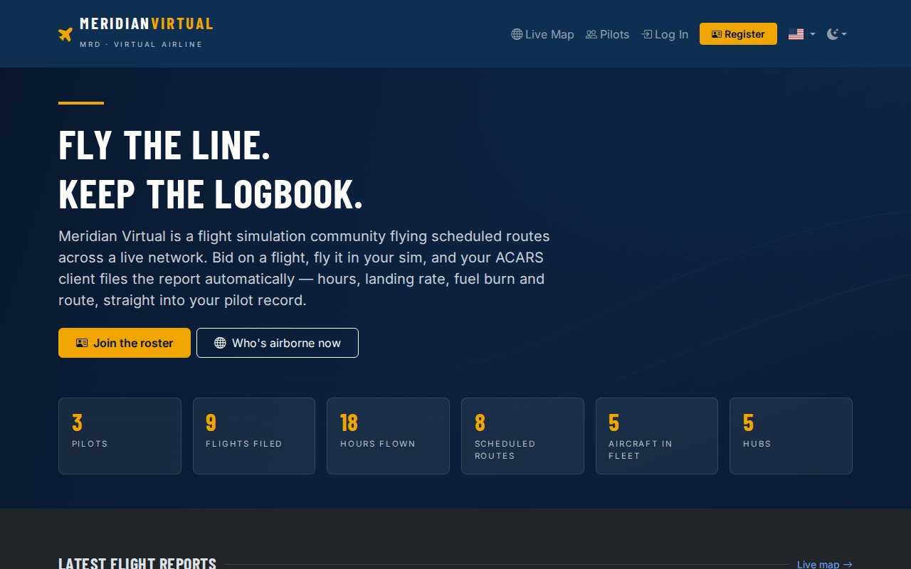
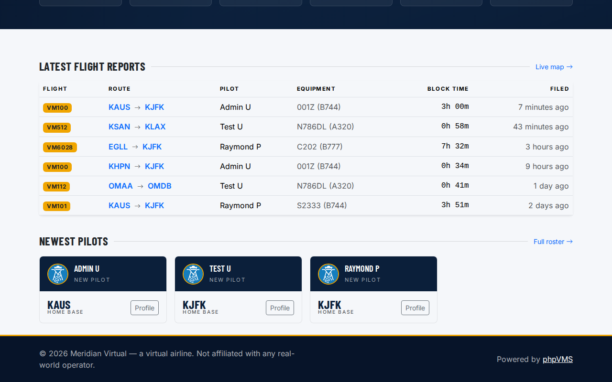
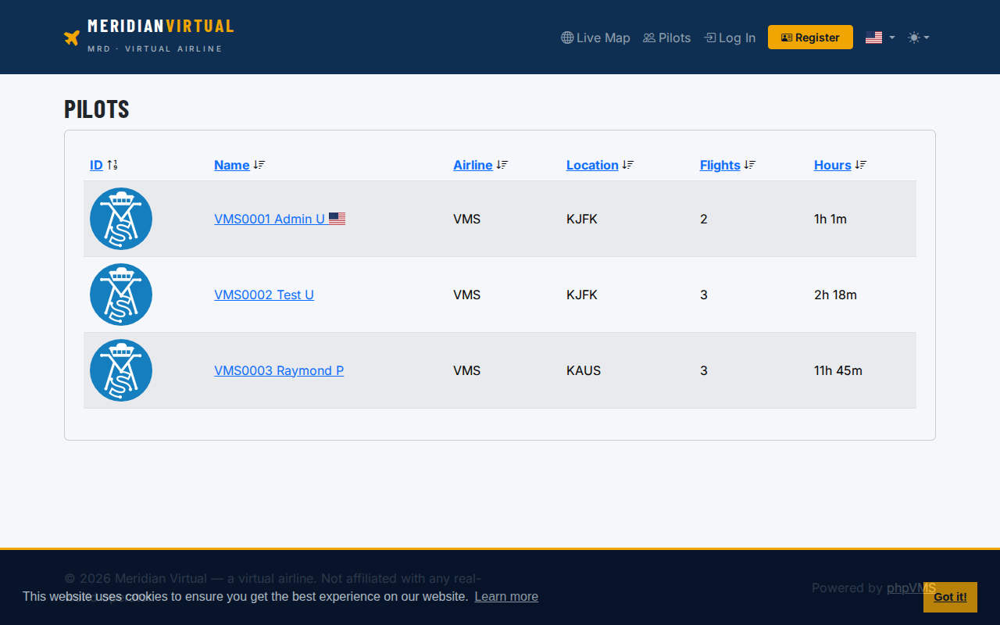
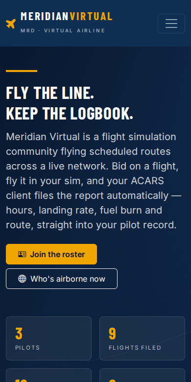

# phpVMS custom skin demo — "Meridian Virtual"

A working custom skin for **phpVMS 7** (the `releases/7.0` line), built to show what a
branded virtual-airline front end looks like without forking or patching phpVMS core.

"Meridian Virtual" is a placeholder airline — the name, the ICAO, the navy/amber palette
and the hero copy are all stand-ins. Swap them for a real VA's branding and nothing else
about the install changes.

## What it looks like

| | |
|---|---|
|  |  |
| Home page, light theme | The same page, dark theme |
|  |  |
| Latest flight reports + newest pilots | The stock roster page, inheriting the skin |



## What it is

Four files. That's the whole skin:

```
layouts/meridian/
├── theme.json        # declares the skin and says it extends "seven"
├── app.blade.php     # page shell: fonts, brand colour variables, footer
├── nav.blade.php     # branded navbar (wordmark + callsign, accent CTA)
└── home.blade.php    # hero, KPI strip, latest-flight-reports table, pilot cards
```

Because `theme.json` declares `"extends": "seven"`, every page that isn't overridden here
— the pilot roster, schedules, the live map, PIREP pages, profiles, the whole admin area —
falls through to the stock theme and picks up the branding automatically from the CSS
variables in `app.blade.php`. That is the point: **upgrades stay boring**. When phpVMS
ships 7.0.x, the stock theme updates underneath and the skin keeps working, because none
of phpVMS's own files were edited.

## The colour system

The entire palette is four variables at the top of `app.blade.php`:

```css
--va-navy:       #0b1f3a;   /* primary: navbar, buttons, headings   */
--va-navy-deep:  #071429;   /* footer, hero gradient, hover states  */
--va-accent:     #f0a500;   /* CTAs, KPI numbers, badges, rules     */
--va-ink:        #16202e;
```

Change those four and the nav, buttons, badges, tables, pilot cards, hero and footer all
follow. Light mode and dark mode are both handled — phpVMS's built-in theme switcher keeps
working.

## Installing it

```bash
# 1. drop the theme folder in
cp -r layouts/meridian /path/to/phpvms/resources/views/layouts/

# 2. phpVMS caches the list of themes, so rebuild it
php artisan theme:refresh-cache
php artisan view:clear

# 3. select it in Admin → Settings → Theme  (or set the `general.theme` setting to `meridian`)
```

## Notes

- Built and screenshotted against phpVMS 7 (`releases/7.0`) on PHP 8.3 with MariaDB 11.
- Note that phpVMS `main` is now **v8.0 and requires PHP ≥ 8.4.1** — check what your host
  actually runs before picking a branch.
- The stats on the home page (pilots, flights filed, hours flown, routes, fleet, hubs) are
  live queries against the install, not hard-coded numbers.
- No phpVMS core file is modified by this skin.

MIT licensed — do whatever you like with it.
